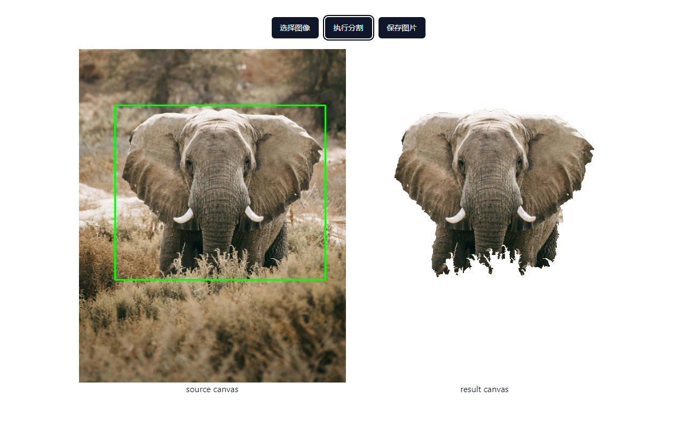

# 基于 OpenCV 的目标分割

一个简单的 OpenCV 分割案例，使用 cv::grabCut 执行分割 [grabCut()](https://docs.opencv.org/3.4/d7/d1b/group__imgproc__misc.html#ga909c1dda50efcbeaa3ce126be862b37f)

## 怎么跑

项目使用 pnpm 作为包管理器，在初始化的时候可以先

```bash
pnpm i
```

装完包以后就可以启动项目

```bash
pnpm dev
```

启动项目后可以使用示例图片框选分割目标来进行分割，也可以自行选择图片框选目标

## 截图


